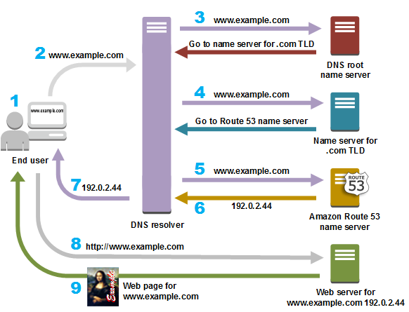

### DNS (Domain Name Service)
---

- 일반적으로 IPv4 주소를 통해서 서비스에 접근을 할 수 있지만 기억하고 숙지하기가 힘들다.
- 이러한 불편함을 해소하기 위한 방법으로 DNS가 있다.
  - ***복잡한 주소 체계를 문자 형태의 도메인 네임으로 연결하는 서비스***이다.

### DNS 서버
---

- DNS를 통해 서비스를 수행할 경우 DNS 서버가 필요하다.

#### DNS 서버 분류
1. **DNS 해석기 (DNS Resolver)**
   - 클라이언트와 네임 서버의 중개자 역할을 한다.
   - ***DNS 요청에 대해 네임 서버로 전달***하여 DNS 응답을 클라이언트에게 전달한다.
2. **루트 네임 서버 (Root Name Server)**
   - DNS 서버의 최상위 네임 서버이다.
   - ***DNS 요청에 대해 적절한 TLD 네임 서버 정보를 반환***한다.
3. **TLD 네임 서버 (Top Level Domain Name Server)**
   - .com, .net과 같은 최상위 도메인에 대한 네임 서버이다.
   - ***DNS 요청에 대해 권한 있는 네임 서버를 지정하여 반환***한다.
4. 권한 있는 네임 서버
   - 일반적으로 권한 있는 네임 서버는 도메인 주소에 대한 IP 주소를 확인하는 마지막 단계이다.

### DNS 레코드 유형
---

- ***도메인에 관한 설정을 하기 위해 사용되는 일련의 문자***들을 DNS 레코드라고 한다.
  - ***A : IPv4 주소를 매핑***
  - ***AAAA : IPv6 주소를 매핑***
  - ***CNAME : 도메인 이름의 별칭을 만듬***
  - MX : 이메일 서버 지정
  - NS : 도메인 네임 서버 식별
  - SOA : 도메인 영역을 표시하는 역할
  - SRV : 도메인 서비스 이용 가능여부 식벽
  - ***TXT : 텍스트 매핑***

### Route 53
---

- Route 53은 AWS에서 제공하는 관리형 DNS 서비스이다.
  - 도메인 이름 구매 대행 및 등록 가능
  - DNS 관리를 할 수 잇는 호스팅 영역을 생성
    - Route 53에 도메인 이름을 등록하면 자동으로 호스팅 영역이 생성된다.
  - 레코드 작성 가능
    - ***레코드를 생성할 땐 다양한 라우팅 정책을 수립***할 수 있다.
  - 도메인 이름에 대한 ***Alias(별칭)***을 지정 가능
    - ***ELB, CloudFront, S3 등의 도메인을 매핑***할 수 있다.
  - VPC용 프라이빗 DNS
    - DNS를 퍼블릭에 노출하지 않고, 내부 AWS 리소스에 대해 프라이빗 DNS를 제공한다.  
  - DNS 장애 조치 및 상태 확인, 모니터링 가능
  - Route 53 Resolver
    - 프라이빗 호스팅 영역과 온프레미스 DNS 서버 간에 도메인 질의를 할 수 있다. 

#### Route 53 작동 원리 

1. 클라이언트가 브라우저 주소창에 www.example.com을 입력한다.
2. 인터넷 서비스 제공업체(ISP: Internet Service Provider)가 관리하는 DNS 해석기로 라우팅된다.
3. ISP의 DNS 해석기는 www.example.com에 대한 요청을 DNS 루트 이름 서버에 전달한다.
4. ISP의 DNS 해석기는 www.example.com에 대한 요청을 이번에는 .com 도메인의 TLD 이름 서버 중 하나에 다시 전달한다.
5. ISP의 DNS 해석기는 Amazon Route 53 이름 서버 하나를 선택해 www.example.com에 대한 요청을 해당 이름 서버에 전달한다.
6. ISP의 DNS 해석기가 사용자에게 필요한 IP 주소를 응답한다.
7. 웹 브라우저는 DNS 해석기로부터 얻은 IP 주소로 www.example.com에 대한 요청을 전송한다.

### Route 53 라우팅 정책
---

- 단순 라우팅 (Simple Routing), IP 기반 라우팅
  - 도메인에 대해 특정 하나의 리소스를 지정한다.
- 가중치 기반 라우팅 (Weighted Routing)
  -  도메인에 대해 다수의 리소스를 지정하고 값에 대한 비중을 두고 라우팅한다.
  - 가중치 값은 0 ~ 255로 설정 가능하다.
- 지연 시간 기반 라우팅 (Latency Routing)
  - Route 53에서 사용자 위치상 인접된 리소스가 있는 리전과의 지연시간을 파악 후 가장 짧은 지연 대상으로 전다한다.
- 장애 조치 라우팅 (Failover Routing)
  - 액티브/패시브로 구성되며, 액티브 리소스가 통신이 불가능할 경우 패시브를 액티브 대상을 변경하여 해당 경로로 라우팅한다.
- 위 라우팅 정책 이외에도 지리 위치 라우팅, 지리 근접 라우팅, 다중값 응답 라우팅 등 다양한 라우팅 정책들이 있다.

