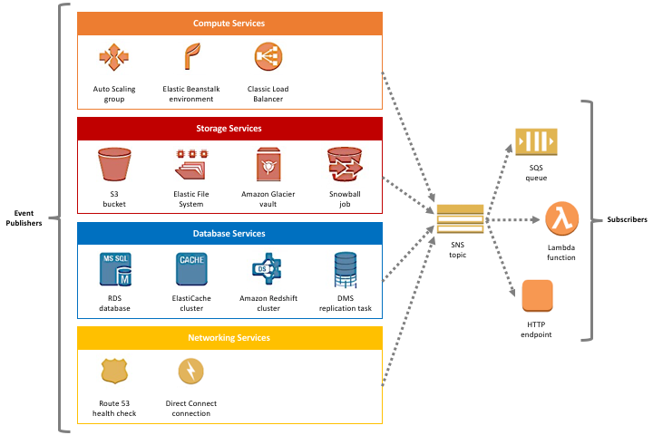

## 1. SNS (Simple Notification Service)

- AWS SNS는 PUB-SUB 구조의 메시지를 전송하는 관리형 서비스이다.
- SNS는 AWS에서 지원하는 서비스, 그 이외의 다양한 프로토콜을 구독자로 설정할 수 있으며, SNS에 메시지를 발행하게 되면 해당 메시지를 각 구독자들이 소비하여 기능을 수행할 수 있다.
  - 하나의 토픽에 여러 구독자들을 연결시킬 수 있다.

### SNS 이벤트 소스

- SNS가 중요한 이유는 단순히 하나의 구독자에게 메시지를 전송하는 것 이외에 AWS에서 발생하는 수 많은 이벤트를 수신할 수 있다는 것이다. 
- 때문에 AWS 서비스를 이용하고 있을 때 특정 이벤트가 발생하는 경우 SNS를 이용하여 특정 기능을 실행시킬 수 있다.

> [AWS SNS > 이벤트 소스](https://docs.aws.amazon.com/ko_kr/sns/latest/dg/sns-event-sources.html#sns-event-sources-storage)  
> [Amazon SNS를 통한 이벤트 기반 컴퓨팅으로 AWS 주요 서비스 활용하기](https://aws.amazon.com/ko/blogs/korea/event-driven-computing-with-amazon-sns-compute-storage-database-and-networking-services/)

## 2. SNS 메시지 필터링

- 기본적으로 SNS 구독자는 토픽에 올라온 메시지를 모두 수신한다.
- 하지만 SNS `MessageAttributes, MessageBody`를 이용하여 특정 구독자만 메시지를 수신받을 수 있도록 설정할 수 있다.
- 메시지 필터링 정책은 구독자가 어떤 메시지를 수신할지를 정의하고 SNS 토픽에 올라온 메시지와 필터링 정책이 일치할 경우 구독자는 해당 메시지를 소비할 수 있다.

### 2.1. SNS 메시지 필터링 활용해보기

- 위 그림을 보면 SNS `주문` 토픽에 메시지를 발행하게 되면, 구독자인 SQS는 `주문`과 해당 주문 건에 대해서 `업체 메시지를 전송`을하게 된다.
- 만약 재고가 없을 경우 주문 토픽에 메시지를 발행할 때 `업체 메시지 전송` 기능만 수행시켜야 기능을 구현하기위해서는 어떻게 해야할까?
- SNS `MessageAttributes, MessageBody`에 주문에 대한 상태 값을 넣어 `주문` SQS는 주문이 가능할 때만 소비하게 만들고, `업체 메시지 전송` SQS는 주문 상태 값을 무시하고 언제든지 메시지를 소비할 수 있도록 메시지 필터링 정책을 구성하여 해당 기능을 구현할 수 있다.

> [AWS SNS > 메시지 필터링](https://docs.aws.amazon.com/ko_kr/sns/latest/dg/sns-message-filtering.html)

## 3. SNS 메시지 전송 재시도

- SNS 구독자에게 메시지를 전달할 때, 서버쪽의 오류가 발생할 경우 전송 정책에 따라서 재시도가 이루어진다. 전송 정책 만큼 재시도를 하였지만 메시지를 전달하지 못하게될 경우 DLQ에 메시지를 전달하게 된다. 만약 DLQ를 사용하지 않는다면 해당 메시지를 삭제한다.

1. SNS 전송 정책 만큼 메시지 전송 재시도
2. DLQ에 메시지를 전달
3. DLQ를 사용하지 않을 시 메시지 삭제

### 3.1. SNS 전송 정책 단계

1. 즉시 재시도 단계 (Immediate Retey Phase)
- 첫 전송 시도 이후 지연시간 없이 즉시 재시도를 하는 단계이다.
2. 프리 백오프 단계 (Pre-Backoff Phase)
- 백오프 단계로 넘어가기전 지정된 지연시간 만큼 재시도한다.
3. 백오프 단계 (Backoff Phase)
- 재시도 백오프 함수를 사용하여 재시도 간 지연 시간을 제어한다.
- 최소 지연시간과 최대 지연 시간을 설정한 다음 재시도 백오프 함수를 사용하여 어느정도 간격으로 지연을 하여 재시도할지를 정의한다.
4. 포스트 백오프 단계 (Post-Backoff Phase)
- 백오프 단계 이후 지정된 지연시간 만큼 재시도한다.

- 구독자에게 전송하는 프로토콜에 따라서 전송 정책이 결정되며 해당 내용은 아래에서 확인할 수 있다.
    > [AWS SNS > 전송 프로토콜 및 정책](https://docs.aws.amazon.com/ko_kr/sns/latest/dg/sns-message-delivery-retries.html#delivery-policies-for-protocols)

### 3.2. DLQ (Dead Letter Queue)
- SNS 전송 정책에 따라서 재시도를 시도하였지만 구독자에게 메시지를 성공적으로 전송할 수 없는 경우 메시지를 삭제한다.
- 하지만 만약 메시지를 삭제하지 않고 다시 리드라이브를 하기 위해서는 DLQ를 설정을 해야한다.
- DLQ 설정은 SNS 토픽이 아닌 SNS 구독자별로 연결된다.

> [AWS SNS > DLQ](https://docs.aws.amazon.com/ko_kr/sns/latest/dg/sns-dead-letter-queues.html)  
> https://birdgang82.medium.com/aws-service-communication-amazonsns-dff3ab3b17b6
