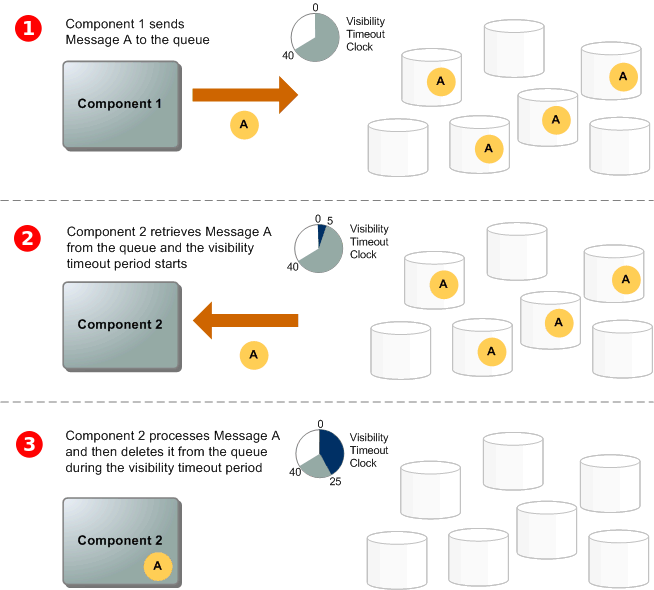
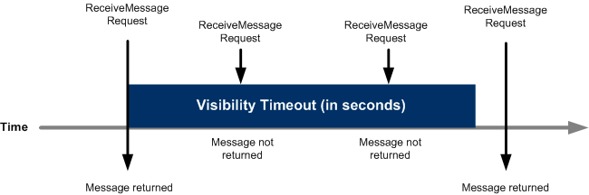

## 1. SQS (Simple Queue Service)

- AWS SQS는 대기 대기열을 이용하여 메시지 전송 및 수신할 수 있는 관리형 서비스이다.
- 메시지의 내구성 및 가용성을 위하여 SQS는 동일한 메시지를 여러 서버(대기열)에 저장한다.
- 기본적으로 메시지 헤더와 바디를 포함하여 256KB보다 큰 메시지를 전송할 수 없지만, DynamoDB 또는 S3를 이용하여 256KB보다 큰 메시지를 전송할 수 있다.

### 1.1. SQS 기본 아키텍처

- SQS는 메시지를 전송하는 Publisher와 해당 메시지를 소비하는 Consumer를 통해서 메시지를 송/수신 한다.
- 

1. Publisher는 메시지를 발행한다. (SendMessage)
2. Consumer는 메시지를 가져온다. (ReceiveMessage)
3. Consumer는 메시지를 수신한 이후 해당 메시지를 대기열에서 삭제한다. (DeleteMessage)
   - SQS는 메시지를 수신받았다고 해서 대기열에서 자동으로 메시지를 삭제하지 않는다.
   - 때문에 ***메시지를 정상적으로 수신받은 이후 대기열에서 메시지 삭제 요청을 해야한다는 특징***이 있다.
   - 만약 메시지를 삭제하지 않는다면 Visibility Timeout (표시 제한 시간)이 지난 이후 소비자는 다시 메시지를 수신받는다.

> [AWS SQS > 기본 아키텍처](https://docs.aws.amazon.com/ko_kr/AWSSimpleQueueService/latest/SQSDeveloperGuide/welcome.html)

## 2. Visibility Timeout (표시 제한 시간)

- SQS는 소비자가 메시지를 수신 받은 이후 대기열에서 메시지를 삭제 처리까지 진행해야한다.
  - ***만약 대기열에서 메시지를 수신받은 이후 자동 삭제처리를 하게되면, 소비자가 정상적으로 메시지를 수신받았다는 것을 확인할 수 없다.***
- 메시지를 수신받은 이후 삭제처리가 진행되는 동안 대기열에는 여전히 메시지가 남아 있기 때문에 다른 소비자들이 해당 메시지를 소비할 가능성이 있다.
- SQS는 이를 해결하기 위해서 Visibility Timeout을 이용하여 다른 소비자가 메시지를 수신하는 것을 막을 수 잇다.
  - Visibility Timeout은 소비자가 메시지를 수신받은 이후 대기열에서 메시지를 잠시 가린다고 생각하면 좋다.

> [AWS SQS > 제한 시간 초과](https://docs.aws.amazon.com/ko_kr/AWSSimpleQueueService/latest/SQSDeveloperGuide/sqs-visibility-timeout.html)

## 3. DLQ (Dead Letter Queue)

- DLQ는 소비자가 메시지 수신이 실패하는 경우 실패한 메시지를 저장해주는 큐이다.
  - 소비자 애플리케이션 에러
  - 생산자와 소비자간의 통신 오류
- DLQ는 소비되지 않은 메시지를 구분하여 처리가 실패한 이유를 확인할 수 있으며, 애플리케이션 또는 메시지 시스템을 디버깅하는데도 유용하다.
- 또한 DQL를 리드라이브하여 기존 SQS 대기열로 다시 메시지를 이동시킬 수 있으며, 이로 인해서 실패한 메시지도 다시 전송할 수 있다.
- 만약 DLQ가 없었다면 대기열에 설정된 보존 기간 만큼 보관되어 있을것이고 계속해서 해당 메시지를 Consumer가 가져온다는 문제점이 있다.

### 3.1. DLQ 작동원리

- 소비자가 메시지를 수신하였지만 메시지를 삭제하지 않은 경우에는 `Visibility Timeout`에 설정된 시간이 지난 이후에은 메시지를 계속해서 수신받을 수 있다.
- 동일한 메시지를 지속적으로 수신받는 다는 것은 재시도를 계속한다는 의미이며, 특정 재시도 횟수가 지나게 되면 DLQ에 삽입된다.
  - `maxReceiveCount`는 메시지가 DLQ로 이동하기 전에 대기열에서 메시지를 삭제하지 않고 수신하려고 시도한 횟수이다.
  - `maxReceiveCount`만큼 수신을 받게되면 DLQ로 이동하게 된다.
  - 만약 `maxReceiveCount`를 1로 설정하게 되면 생산자와 소비자간의 통신 오류로 잠깐의 통신 오류로 인해서도 메시지가 DLQ에 담기게된다.
  - 때문에 애플리케이션 오류가 아닌 시스템이 회복되는 시간 만큼은 계속 재시도를 허용할 수 있도록 1보다 큰 값을 설정하는 것이 좋다.

### 3.2. DLQ 리드라이브

- DLQ에 보관된 메시지를 기존 SQS 대기열로 이동시킬 수 있는데 이를 DLQ 리드라이브라고 한다.
- 애플리케이션 오류로 인해서 SQS 메시지가 DLQ로 이동하였을 때, 애플리케이션 수정 이후 DLQ 리드라이브를 하면 정상적으로 처리될 수 있다.
- AWS SQS 콘솔에서 리드라이브를 수동으로 할 수 있으며, API도 제공되어 있기 때문에 자동으로 처리도 가능하다.
  - `StartMessageMoveTask` : 대기열로 메시지를 이동
  - `ListMessageMoveTasks` : 가장 최근의 메시지를 이동
  - `CancelMessageMoveTask`: 메시지 이동 작업을 취소

> [AWS SQS > DLQ(Dead Letter Queue)](https://docs.aws.amazon.com/ko_kr/AWSSimpleQueueService/latest/SQSDeveloperGuide/sqs-dead-letter-queues.html)  
> [Amazon SQS DLQ(Dead Letter Queue) 리드 라이브를 위한 새로운 API](https://aws.amazon.com/ko/blogs/korea/a-new-set-of-apis-for-amazon-sqs-dead-letter-queue-redrive/)  
> https://channel.io/ko/blog/tech-backend-aws-sqs-introduction  
