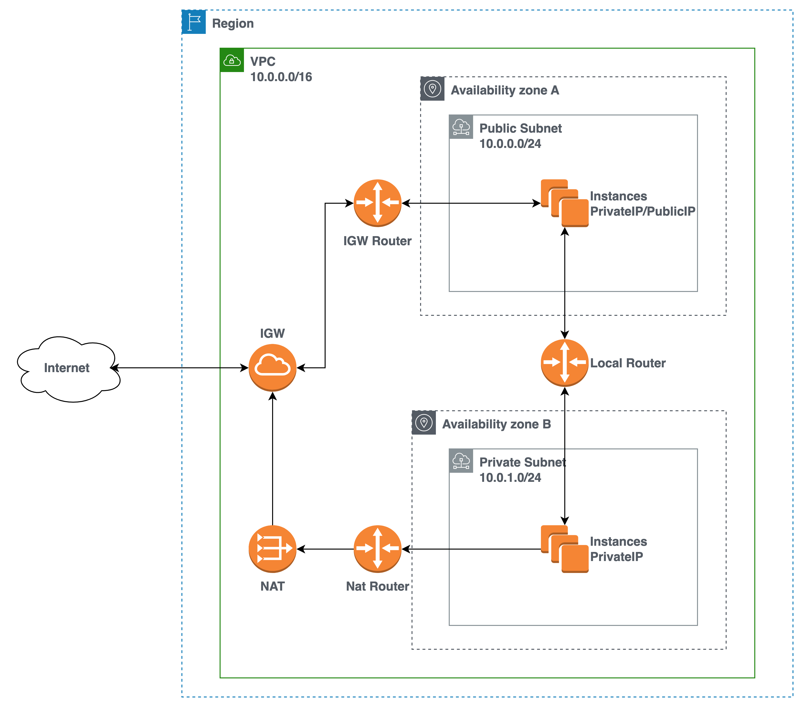
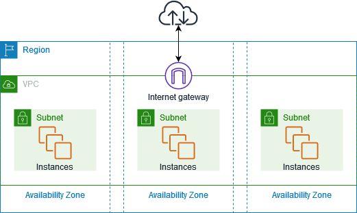

## 1. Public/Private Subnet 구성하기 전 알아야할 간단한 개념

### 1.1. VPC (Virtual Private Cloud)

- VPC는 AWS 클라우드 내에서 다른 VPC와 논리적으로 구분되어 있는 가상 네트워크이다.
  - VPC 내에서 다양한 AWS 리소스를 시작할 수 있다.
- VPC를 이용하여 복수의 가용영역(AZ: Availibity Zone)에 리소스들이 존재할 수 있으며, 같은 사설IP 대역에 위치하게 만들어 리소스들끼리 통신할 수 있게 만들어준다.
  - 만약 서비스에 필요한 리소스가 하나의 가용영역에 존재할 때, 가용영역에 문제가 발생하면 사용자는 해당 서비스를 이용할 수 없는 문제가 발생한다.
  
> [AWS > Amazon VPC란 무엇인가?](https://docs.aws.amazon.com/ko_kr/vpc/latest/userguide/what-is-amazon-vpc.html)

### 1.2. 서브넷 (Subnet)

### 1.3. 서브넷 (Router)

### 1.4. 인터넷 게이트웨이 (Router)

### 1.4. NAT (Network Address Transfer)
- 서브넷 (Subnet)
- 라우터/라우터 테이블 (Route table)
- 인터넷 게이트웨이 (Internet GateWay)
- NAT (Network Address Transfer)