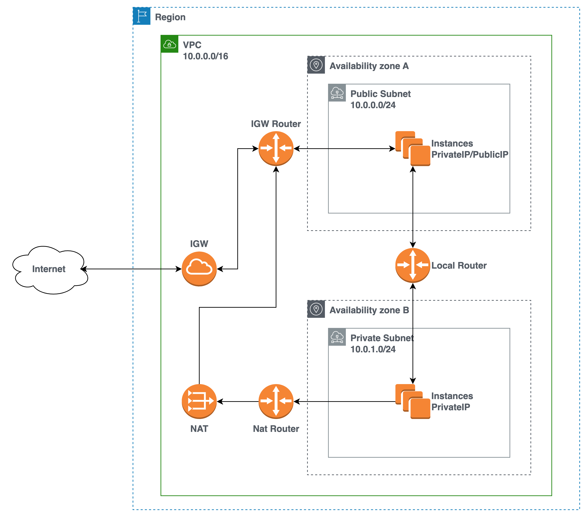

## 1. Public/Private Subnet 구성하기 전 알아야할 간단한 개념

### 1.1. VPC (Virtual Private Cloud)

- VPC는 AWS 클라우드 내에서 다른 VPC와 논리적으로 구분되어 있는 가상 네트워크이다.
  - VPC 내에서 다양한 AWS 리소스를 시작할 수 있다.
- VPC를 이용하여 복수의 가용영역(AZ: Availibity Zone)에 리소스들이 존재할 수 있으며, 같은 사설IP 대역에 위치하게 만들어 리소스들끼리 통신할 수 있게 만들어준다.
  - 만약 서비스에 필요한 리소스가 하나의 가용영역에 존재할 때, 가용영역에 문제가 발생하면 사용자는 해당 서비스를 이용할 수 없는 문제가 발생한다.
  
> [AWS > Amazon VPC란 무엇인가?](https://docs.aws.amazon.com/ko_kr/vpc/latest/userguide/what-is-amazon-vpc.html)

### 1.2. 서브넷 (Subnet)

- 서브넷이란 네트워크 영역을 분할하여 더 작은 크기의 네트워크 영역으로 쪼갠 네트워크이다.
- AWS VPC에서 서브넷의 역할은 VPC의 부분적인 네트워크 역할을 한다. IP 주소 범위를 통해서 VPC내에서 1개 이상의 네트워크 망을 구축할 수 있다.
> 서브넷간 서로 구분짓기 위하여 사용되는 것이 서브넷 마스크(Subnet Mask)이며 IP주소에 네트워크 ID와 호스트 ID를 구분하는 기준값이다.
> 서브넷 IP 주소 범위를 IP CIDR 표기법을 이용하여 서브넷을 구분지을 수 있다.
- 각 서브넷은 단일 가용 영역 내에만 존재하며, 장애로부터 보호하기 위해서는 2개 이상의 가용영역에서 2개이상의 서브넷을 활용하는 것이 좋다.
- 서브넷 단위로 보안 그룹을 설정할 수 있는 네트워크 ACL은 사용하여 서브넷 수준에서 인바운드 및 아웃바운드 트래픽을 허용하거나 거부할 수 있다.
- 서로 다른 서브넷간의 통신을 위하여 라우팅 테이블이 활용된다.

> [AWS > VPC의 서브넷](https://docs.aws.amazon.com/ko_kr/vpc/latest/userguide/configure-subnets.html)

### 1.3. 라우팅 (Router)
- 복잡하게 연결된 네트워크망에서 미리 정해진 규칙에 따라서 최상의 경로를 통해 목적지에 도달하는 것이 라우팅이다.
- 라우팅을 수행하는 장비인 라우터는 라우팅 테이블을 통해 경로를 파악하고 목적지로 데이터를 전달한다.
- AWS 라우팅 테이블은 서브넷 또는 게이트웨이의 네트워크 트래픽이 전송되는 위치를 결정하는 하며, 서브넷 별로 라우팅 테이블을 매핑시켜줄 수 있다.
  - public 서브넷은 IGW, private 서브넷은 NAT

> [AWS > 라우팅이란 무엇입니까?](https://aws.amazon.com/ko/what-is/routing/)

### 1.4. 인터넷 게이트웨이 (Internet Gateway)
- 인터넷 게이트웨이는 VPC와 외부 인터넷 간 연결을 해주며, VPC에서 외부 인터넷 구간으로 나가는 관문이다.
- 외부 인터넷 구간으로 통신할 수 있는 대상은 퍼블릭 IP를 사용하는 퍼블릭 서브넷 내의 서비스들이다.
- 인터넷 게이트웨이는 VPC당 1개만 연결이 가능하다.

### 1.4. NAT 게이트웨이 (Network Address Transfer Gateway)
- NAT 게이트웨이는 IP 주소를 변환해주는 기술이다.
- 외부 인터넷과 통신을 하기 위해서는 퍼블릭 IP를 통해 통신이 이루어지기 때문에, 프라이빗 IP로는 통신이 불가능하다.
- NAT 게이트웨이를 통해서 프라이빗 IP 주소를 퍼블릿 IP로 변환하여 통신을 할 수 있도록 도울 수 잇다.
- 